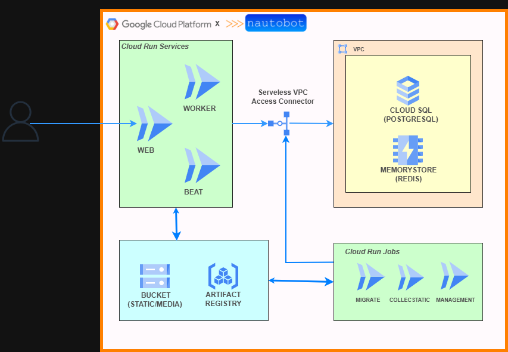

# nautobot-2.4-gcp-cloud-run
## 🏗️ Overall Architecture — Nautobot on Google Cloud Platform

Below is the complete architecture used to deploy Nautobot in a fully serverless and scalable on Google Cloud Platform.



---

## 🌐 Cloud Run Services

| Service | Purpose | Description |
|---------|----------|-------------|
| **WEB** | User Interface & API | Serves the Nautobot UI, authentication, REST & GraphQL APIs |
| **WORKER** | Celery Worker | Executes asynchronous tasks such as job execution, data processing, and webhook handling |
| **BEAT** | Celery Beat | Schedules periodic tasks (maintenance, sync jobs, cleanups, webhook retries…) |

All three services share the same Docker image stored in **Artifact Registry**, following best practices for immutability.

---

## ⚙️ Cloud Run Jobs

| Job | Purpose |
|------|----------|
| **MIGRATE** | Runs Django/Nautobot database migrations |
| **COLLECTSTATIC** | Publishes static files to Google Cloud Storage |
| **MANAGEMENT** | Administrative tasks (log cleanup, superuser bootstrap, maintenance scripts…) |

Cloud Run Jobs ensure **deterministic provisioning** and safe deployment workflows.

---

## 🗄️ Data Layer (Private VPC)

| Component | GCP Service | Purpose |
|-----------|--------------|---------|
| **PostgreSQL** | Cloud SQL | Primary database for Nautobot |
| **Redis** | Memorystore | Celery broker, Celery backend, Django caching |
| **Bucket** | Cloud Storage | Static & media assets |

All communication happens through a **Serverless VPC Access Connector**, ensuring secure internal traffic.

---

## 📦 Artifact Registry

Artifact Registry hosts the container image used by:

- WEB (Cloud Run Service)
- WORKER (Cloud Run Service)
- BEAT (Cloud Run Service)
- MIGRATE / COLLECTSTATIC / MANAGEMENT (Cloud Run Jobs)

This guarantees immutability and consistent deployments across all components.

---

## 🔒 Security & Networking

- Private connectivity through the VPC connector  
- Redis & SQL isolated inside a private subnet  
- Secrets fully managed with **Secret Manager**  
- Optional integrations: Cloud Armor, HTTPS Load Balancer, Identity-Aware Proxy (IAP)

---

## 🚀 Benefits

This architecture delivers:

- **True serverless deployment** (no servers to manage)
- **Automatic scaling** per component (web / worker / scheduler)
- **Strong security posture**
- **Simplified operations & maintenance**
- **Optimized cost structure**

---

## 🐳 Container Build & Push / Deploy

Before deploying to Cloud Run, you need to build your Nautobot container image and push it to **Artifact Registry**.

### **1 Build the Docker image**

```bash
gcloud auth configure-docker <<region>>-docker.pkg.dev
```
```bash
docker build -t <<region>>-docker.pkg.dev/<<project-id>>/nautobot/nautobot:v1 . --no-cache
```
```bash
docker push <<region>>-docker.pkg.dev/<<project-id>>/nautobot/nautobot:v1
```

### **2 Deploy with terraform**
```bash
terrafom init 
terraform plan 
terraform apply 
```

---

## 📘 Note

For production environment:
- Expose the nautobot web with loadbalancer
- Use Cloud Armor
- GCS will be access only via authentication
- Remove the public access on the nautobot web cloud run service
- Use pipeline CI/CD for the build and deployment
